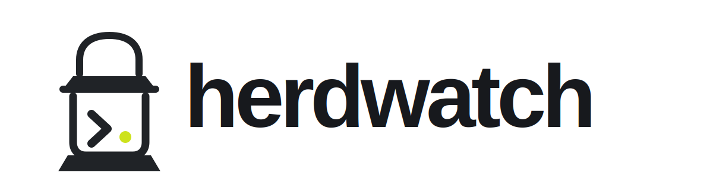

<p align="center">
  
</p>

<p align="center">
  <a href="https://github.com/vaclavik-xyz/herdwatch/actions/workflows/ci.yml"></a>
</p>

## The problem

Your coding agent finishes its turn, so [herdr](https://herdr.dev) shows the
pane `idle`/`done`. But the work isn't actually done: you just merged and CI is
running, a post-commit review is in flight, or a job is still going in the
background. You glance at the sidebar, see "done", switch to that pane — and
nothing's happening, because the real work is off-screen. So a pane that *looks*
finished isn't, and you can't trust the sidebar at a glance.

herdwatch fixes that: while background work is still pending after an agent goes
idle, it adds a `⏳` label saying what it is waiting on (CI, roborev review, a
manual marker, or — opt-in — a background job). When herdr permits a custom
lifecycle authority, herdwatch also keeps the pane shown as **working** and
releases it the moment the work clears.

> **Setting this up via a coding agent?** Point it at [AGENTS.md](AGENTS.md) — a
> runbook it can follow to install, enable, and verify herdwatch on your machine.

## How it works

herdwatch is a standalone background daemon — **not** a herdr fork and not a
screen-scraper. It requires **herdr ≥ 0.7.4** and talks directly to herdr's
socket API. It bootstraps from `session.snapshot`, subscribes to herdr's socket
events (`pane.agent_status_changed` for every pane plus lifecycle events),
reacts to idle/done edges within ~100 ms, and re-verifies against a fresh snapshot every
`resync_interval_s` (60 s by default), so correctness never depends on seeing
every event. Retained lifecycle-event replays are coalesced before that snapshot,
so the subscription stays drained. For idle panes, herdwatch runs a set of
probes; while any probe is pending it requests `working` through
`pane.report_agent`, verifies the applied lifecycle state, and publishes the
description as the `waiting_on` metadata token. No per-agent setup is needed.

CI runs are assigned to one pane instead of broadcast to every pane that shares
the repository. An exact checkout HEAD match wins; when agents operate on a
linked worktree while their pane stays in the main checkout, herdwatch falls
back to the repository's only actively working pane and keeps that assignment
when the agent becomes idle. Ambiguous runs are left unassigned rather than
labeling unrelated panes. A working owner receives the CI description as the
display-only `waiting_on` token, so its real lifecycle state remains `working`.

Herdwatch deliberately replaces the replay-heavy global
`pane.agent_detected` feed with status subscriptions on all panes, including
currently unknown ones. The first `unknown → working` edge still triggers an
immediate snapshot, without destabilizing status delivery for known agents.

A pane herdr reports as `done` keeps that semantic state. If work is still
pending, herdwatch adds a **display-only** `waiting_on` token via
`pane.report_metadata`. When you view the pane and herdr
transitions it from `done` to `idle`, herdwatch refreshes the token; if
the work is still pending, a normal `working ⏳` hold takes over.

**The key trick** (reusable for any similar tool): when accepted, a state
reported through `herdr pane report-agent --source <name>` is authoritative and
durable over screen detection for as long as that source holds it. Herdr
can silently reject that request when an official integration already owns the
pane session while still returning `ok`. Herdwatch therefore verifies the
effective state. On such a session-owned pane it uses TTL-backed display
metadata instead: the pane remains semantically `idle`, while the separate
Herdeck dashboard derives `WAITING` from `waiting_on`; herdwatch never releases
or disturbs the official owner.

The daemon also publishes the set of panes it is currently managing (and the
recorded `⏳` label per pane) to a small JSON state file
(`~/.local/state/herdwatch/managed.json`), so `herdwatch status` — a separate
process — can show what herdwatch is holding right now. The snapshot records the
daemon's pid, so `status` can tell a live snapshot from one a dead daemon left
behind. On startup the daemon reads that file back and re-adopts those panes, so
a crash-and-restart reconciles them (next tick re-probes → re-asserts or
releases) instead of orphaning a `working ⏳`.

## Task progress in the sidebar

While a Claude Code agent is actively working through a task list, herdwatch
shows how far along it is — `3/7 Fixing auth bug` — through the pane's
`progress` token. It reads the session's task files (`~/.claude/tasks/`, matched via
herdr's `agent_session` id), so no per-agent setup is needed; other agents
are skipped. Progress is display-only metadata published through
`pane.report_metadata`; herdr keeps detecting the real lifecycle state beneath
it, so the label never masks `blocked` or `idle`. Disable with:

```toml
[progress]
enabled = false
```

## Install & run

**From source (recommended for now):**

    git clone https://github.com/vaclavik-xyz/herdwatch && cd herdwatch
    python3 -m venv .venv && .venv/bin/pip install .
    .venv/bin/herdwatch doctor            # check herdr is reachable + what's set up
    .venv/bin/herdwatch daemon            # run in the foreground to try it

Prerequisites: a running herdr; optionally `gh` (authenticated) for the CI probe
and `roborev` for the review probe. A missing tool just disables its probe — it
never blocks a pane.

**As a launchd service (auto-start / auto-restart), macOS:**

    herdwatch install-service              # generate a plist with the right paths for THIS machine + load it
    herdwatch install-service --dry-run    # preview the plist first
    herdwatch install-service --uninstall  # unload + remove

(`deploy/dev.herdwatch.daemon.plist` is only a static example; `install-service`
generates the real one so the paths are correct on any machine. Unloading the
service releases all panes herdwatch manages.)

**As a herdr plugin** (`herdr-plugin.toml` is included):

    herdr plugin install vaclavik-xyz/herdwatch   # clones + builds a local venv
    herdr plugin pane open --plugin herdwatch --entrypoint daemon

The plugin build creates a `.venv` and installs the package; the `daemon` pane
runs the watcher inside herdr (no launchd needed). `status` and `list-markers`
actions are registered too.

## Manual markers

    herdwatch add "deploy" --until 'gh run watch --exit-status'
    herdwatch add "backup" --ttl 600
    herdwatch list
    herdwatch status         # what the daemon holds right now + active markers
    herdwatch rm <id>

## Config

`~/.config/herdwatch/config.toml` — enable/disable probes, intervals, per-pane
`allow`/`deny`, and per-probe tuning. Everything has a sensible default; the
file is optional. The full set of keys:

```toml
[daemon]
resync_interval_s = 60      # fresh snapshot safety-net interval
reprobe_interval_s = 15     # min seconds between probing the same pane

[probes]
ci = true                   # on by default: roborev, ci, marker
roborev = true              # bgjobs is OFF by default (opt-in below)

# Per-probe tuning goes in its own table. Because TOML forbids a key that is
# both a value and a table, enable/disable a tuned probe with `enabled` INSIDE
# its table (not `bgjobs = true` under [probes] as well).
[probes.bgjobs]
enabled = true              # opt in to background-job detection
min_age_s = 5               # ignore just-spawned processes
ignore = ["vite", "webpack"]  # extra process names to treat as "not a job"
                              # (added on top of the built-in defaults)

[progress]
enabled = true               # default
interval_s = 4               # how often to refresh task progress

[panes]
allow = []                  # if non-empty, only manage these pane ids
deny  = []                  # never manage these pane ids
```

**Why bgjobs is opt-in:** herdr is an agent multiplexer, so every pane runs an
agent, and agents constantly spawn short-lived subprocesses (`sleep`, `git`,
test runners, an editor daemon, their own runtime). The background-job probe
scans a pane's process tree, so on agent panes it readily mistakes those for
"work" and holds the pane. The reliable signals — CI, roborev, and manual
markers — are on by default; enable bgjobs only on panes where you actually run
long jobs by hand, and use `[probes.bgjobs] ignore` to teach it which process
names to skip.

## v1 limitations

- **Requires herdr ≥ 0.7.4.** The daemon needs socket `session.snapshot`, event
  subscriptions, and named metadata tokens. There is no fallback for older
  metadata fields; `herdwatch doctor` checks this requirement.
- **Herdr session ownership can prevent semantic holds.** If an official
  integration such as `herdr:claude` or `herdr:codex` owns `agent_session`,
  herdr rejects a third-party `pane.report_agent` lifecycle authority. Herdwatch
  fails safe and publishes only `waiting_on` for that pane. Herdeck still
  renders it as `WAITING`. A future herdr semantic-overlay/lease API is needed to keep these panes
  truly `working` without impersonating or clearing the official owner.
- **`status` is a snapshot, not a live query.** `herdwatch status` reads the
  state file the daemon writes each sweep, so it lags reality by up to one
  sweep interval. If the daemon died uncleanly the file lingers, but `status`
  flags this by checking the recorded pid. (`socket_path` in config is reserved
  for a future live status channel and is currently unused.)
- **Recovery depends on the state file.** On clean shutdown (SIGTERM / launchctl
  unload) herdwatch releases every pane it manages. After an *unclean* death it
  reconciles on restart by re-adopting the panes from
  `~/.local/state/herdwatch/managed.json` — but if that file is deleted while the
  daemon is down, any pane held at crash time is left showing `working ⏳` until
  it next becomes busy-then-idle.
- **No "step aside" while a `⏳` hold is active.** While herdwatch asserts
  `working` for an idle pane, its own assertion masks the agent's real status,
  so it cannot detect the human resuming genuine work mid-wait; the hold
  persists until the background work clears. Display-only progress tokens do
  not mask the underlying lifecycle state.
